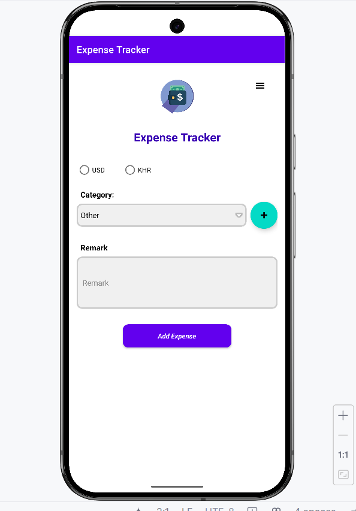
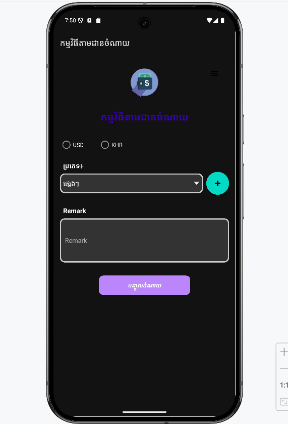

# Expense Tracker

Expense Tracker is an Android application developed using Java, Kotlin, and Gradle. The app allows users to track their expenses with a modern UI that supports both light and dark modes.

## Features

- **Light/Dark Mode:** The app adapts its UI based on the chosen theme.
- **User-Friendly Interface:** Uses ConstraintLayout and Material Design components.
- **Expense Logging:** Quickly add and view expense records.
- **Intuitive Navigation:** Easy to navigate with clearly defined sections and controls.

## Screenshots

### Light Mode


### Dark Mode


## Prerequisites

- Android Studio (Ladybug Feature Drop | 2024.2.2 or later)
- Java JDK 8 or above
- Kotlin 1.5 or above
- Gradle

## Installation

1. **Clone the Repository:**

   ```sh
   git https://github.com/Remy2404/MAD_LAB.git
   cd Expense_Tracker
   ```

2. **Open the Project in Android Studio:**

    - Open Android Studio.
    - Click on _File_ > _Open_ and select the project root directory.

3. **Sync Gradle:**

    - Android Studio will prompt you to sync the Gradle files. Click on _Sync Now_.
    - Alternatively, you can use the command-line:

      ```sh
      ./gradlew build
      ```

## Usage

- **Run the Application:**
    - Use the _Run_ button in Android Studio or execute `./gradlew installDebug` from the command line.
- **Version Control:**
    - The project is integrated with Git. Use the _VCS_ menu in Android Studio to commit, push, and pull changes.
